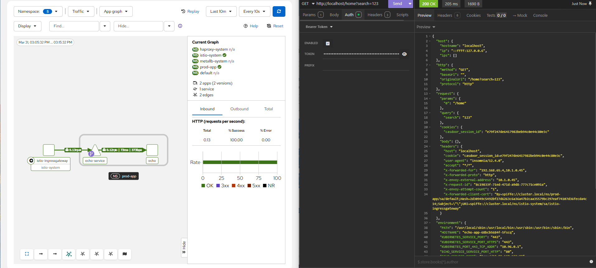

# Beehive Security & Infrastructure PoC

This repository contains a functional Proof of Concept (PoC) for the Beehive digital repository, focusing on enterprise-grade security, identity management, and cloud-native deployment.




## ⚠️ **Important Implementation Note !!!**

**Please Note:** This Proof of Concept (PoC) is intentionally designed as a **comprehensive, "high-spec" architectural draft**. 

* **Current State:** The deployment currently utilizes a lightweight `echo-app` as a placeholder to demonstrate the routing and security perimeter (Istio + WAF + IAM).
* **Final Implementation:** During the project lifecycle, the existing `docker-compose` application services will be fully migrated into this Kubernetes/Helm framework.
* **Customization:** All configurations, security rules, and infrastructure modules will be strictly fine-tuned and hardened to meet the specific requirements of the official Beehive technical assignment.

This PoC serves as a "maximum-capability" template to prove the scalability and robustness of the chosen stack.


## 🚀 Quick Start

To deploy the infrastructure, ensure your Kubernetes context is set and run the following commands:

```bash
terraform init
terraform apply -auto-approve
```

💻 Environment

 - Tested on: Windows 11
 - Runtime: Docker Desktop (Kubernetes enabled)
 - Tools: Terraform / OpenTofu, Helm

🎯 Motivation & Design Philosophy
1. Separation of Concerns & Scalability The project requirements emphasize strict security, rapid deployment, and detailed observability. Instead of writing "vendor-locked" or fragmented glue code, this approach utilizes a compact Infrastructure-as-Code (IaC) stack. By delegating non-business logic (authentication, edge security, routing) to specialized middleware layers (Istio/Coraza), the application remains scalable and easily adaptable to any network or hardware environment.
2. Modular Architecture The goal is to provide a flexible IaC installation where security and infrastructure modules can be toggled based on hardware constraints, network topology, or the specific needs of the healthcare environment.
3. Proven Industry Standards The stack is built on battle-tested, community-driven technologies (Istio, Casdoor, Coraza WAF). We intentionally avoid "exotic" or experimental tools to ensure long-term stability and ease of maintenance for future contributors.
4. Simplicity & Transparency Designed to be lightweight and developer-friendly—ensuring the entire security perimeter and application core can be stood up quickly, transparently, and with minimal manual intervention.